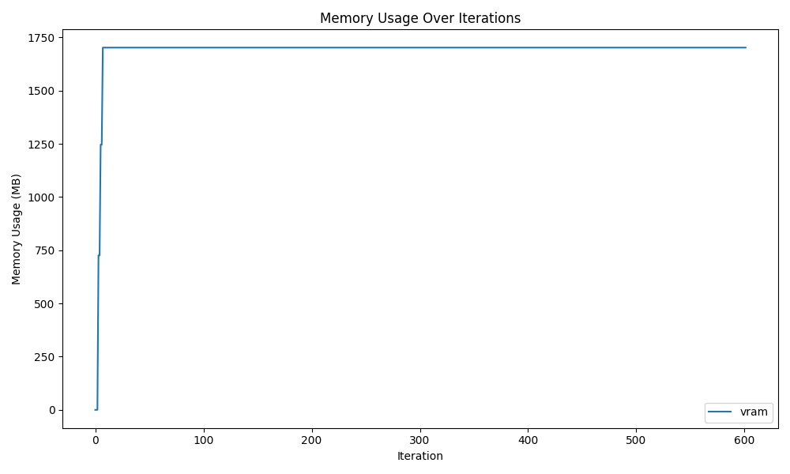
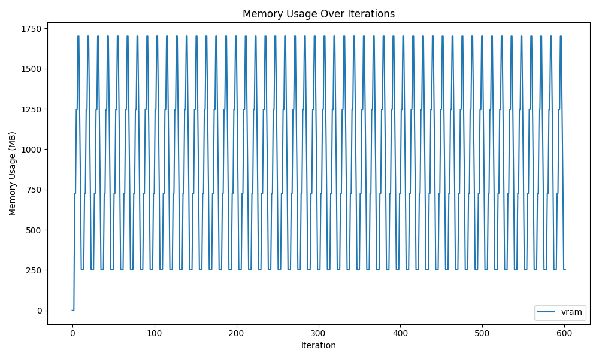
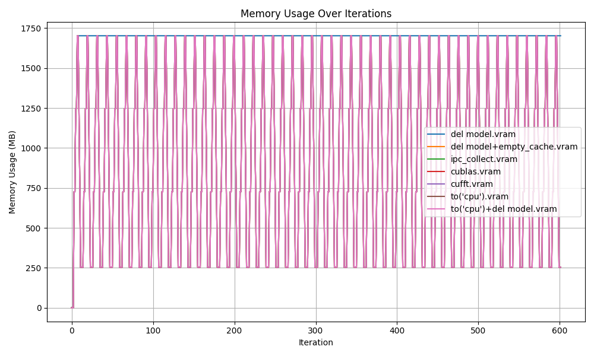

# HuggingFace Model Memory Cleanup Experiment

HuggingFaceのモデルをメモリから解放する方法の調査。  
このリポジトリはHuggingFaceモデルを対象としていますが、PyTorchモデルでも同じ方法が使えます。

This repository is for HuggingFace models, but you can also use PyTorch models.

## CPU

```bash
cd cpu
./run.sh
```

### 1. `del model; gc.collect();`で削除


### 2. モデルのパラメータを手動で削除 + `del model; gc.collect();`


### 3. `del model; gc.collect();` + `ctypes.CDLL("libc.so.6")`で削除


### 4. モデルのパラメータを手動で削除 + `del model; gc.collect();` + `ctypes.CDLL("libc.so.6")`で削除


### 5. `os.environ["MALLOC_TRIM_THRESHOLD_"] = "-1"` + `del model; gc.collect();`で削除


### 6. `export MALLOC_TRIM_THRESHOLD_=-1` + `del model; gc.collect();`で削除


### All


## GPU

```
cd gpu
./run.sh
```

C++ CUDA

```bash
cd gpu
nvcc main.cu
./a.out
```

### 1. `del model; gc.collect();`



### 2. `del model; gc.collect();` + `torch.cuda.empty_cache()`


### 3. `del model; gc.collect();` + `torch.cuda.empty_cache()` + `torch.cuda.ipc_collect()`


### 4. `del model; gc.collect();` + `torch.cuda.empty_cache()` + `torch.cuda.ipc_collect()` + `torch._C._cuda_clearCublasWorkspaces()`



### 5. `del model; gc.collect();` + `torch.cuda.empty_cache()` + `torch.cuda.ipc_collect()` + `torch._C._cuda_clearCublasWorkspaces()` + `torch.backends.cuda.cufft_plan_cache.clear()`


### 6. `model.to("cpu")` + `del model; gc.collect();` + `torch.cuda.empty_cache()` + `torch.cuda.ipc_collect()` + `torch._C._cuda_clearCublasWorkspaces()` + `torch.backends.cuda.cufft_plan_cache.clear()`


### 7. `model.to("cpu")` + `del model; gc.collect();` + `torch.cuda.empty_cache()` + `torch.cuda.ipc_collect()` + `torch._C._cuda_clearCublasWorkspaces()` + `torch.backends.cuda.cufft_plan_cache.clear()` + `cudaDeviceReset()`

Error

### All


