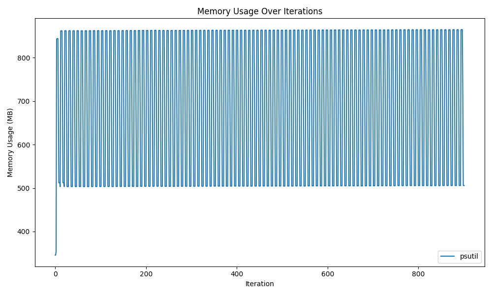
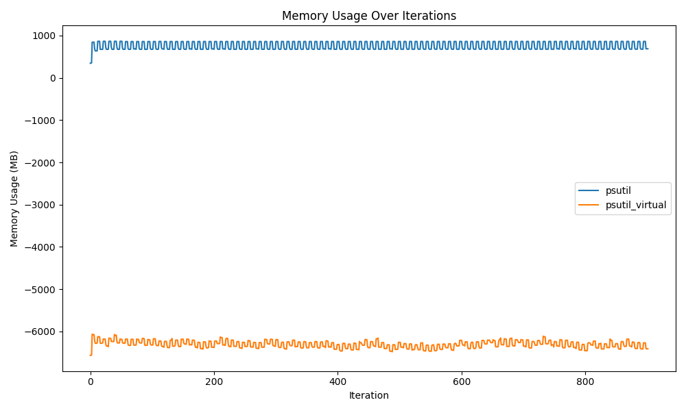
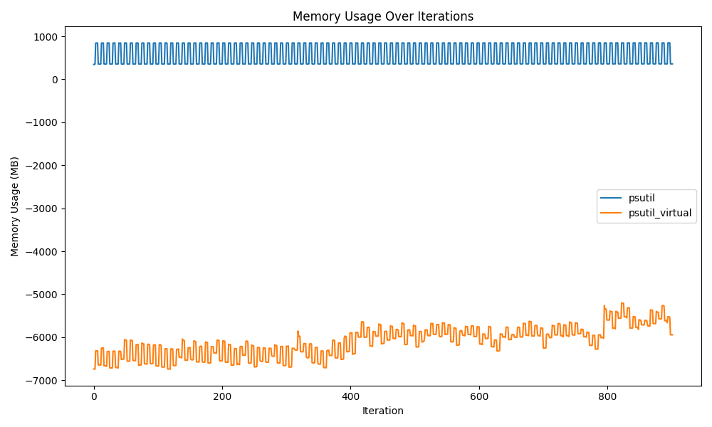
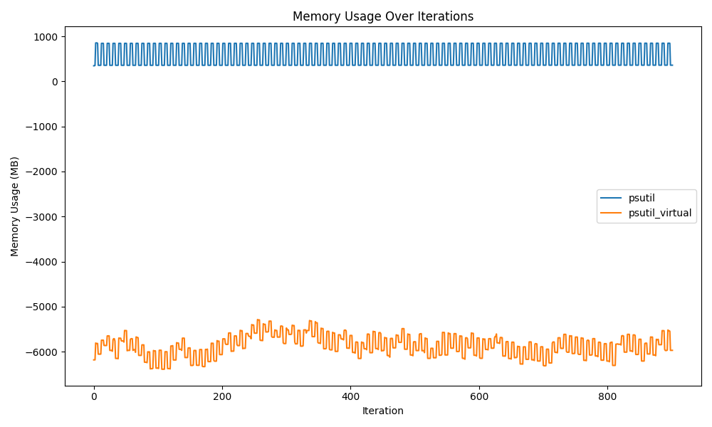
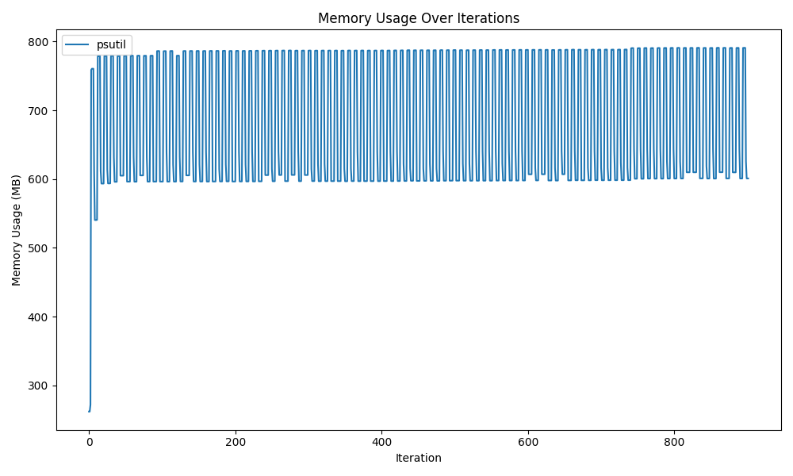
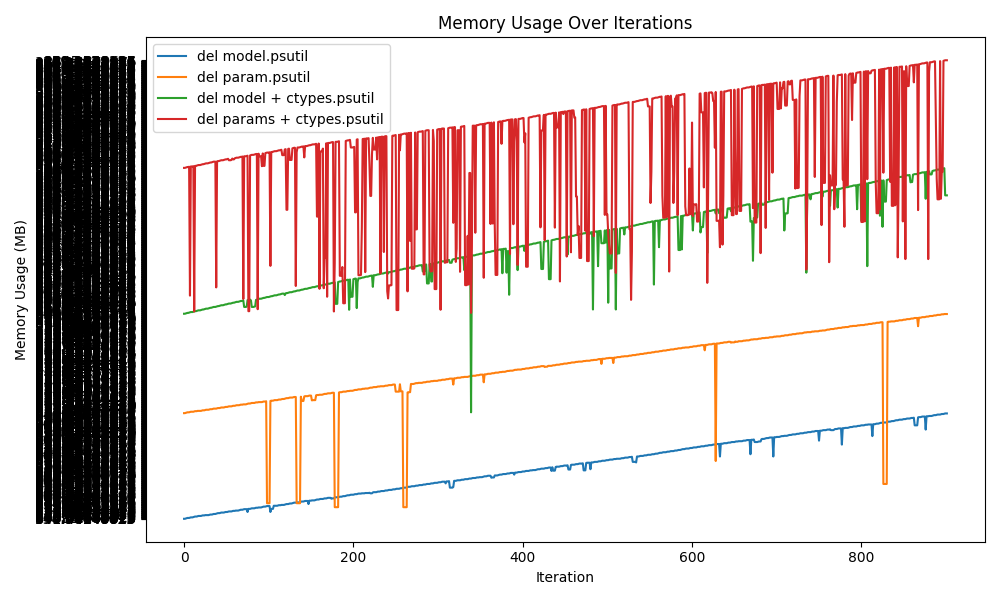

# HuggingFace Model Memory Cleanup Experiment

HuggingFaceのモデルをメモリから解放する方法の調査。

```bash
docker build -t memory-profiler .
docker run -it --rm -v $(pwd):/app memory-profiler python /app/1.py
```

## 1. `del model; gc.collect();`で削除



## 2. モデルのパラメータを手動で削除 + `del model; gc.collect();`



## 3. `del model; gc.collect();` + `ctypes.CDLL("libc.so.6")`で削除



## 4. モデルのパラメータを手動で削除 + `del model; gc.collect();` + `ctypes.CDLL("libc.so.6")`で削除



## 5. `os.environ["MALLOC_TRIM_THRESHOLD_"] = "-1"` + `del model; gc.collect();`で削除



## All


