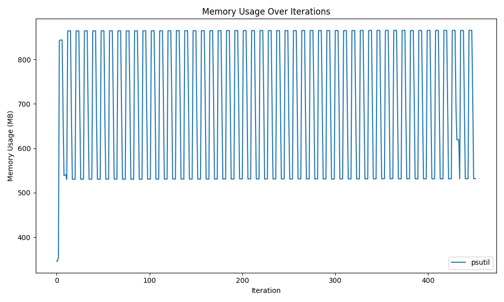
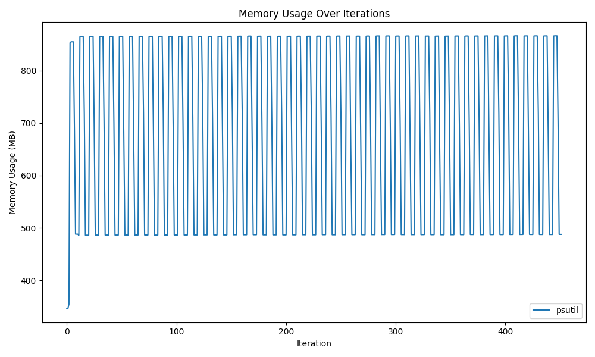
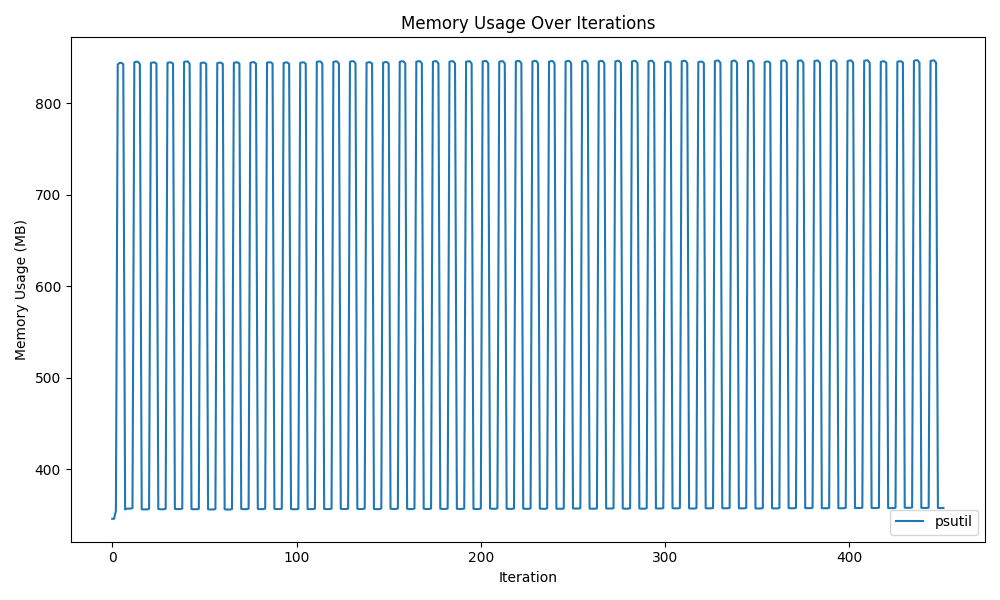
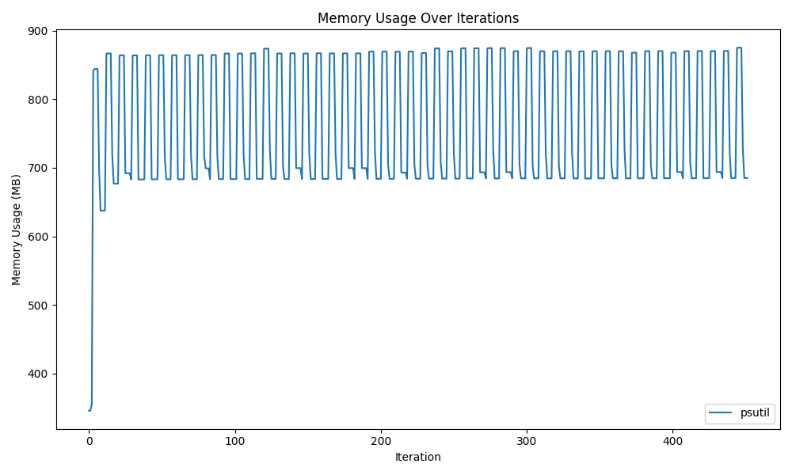
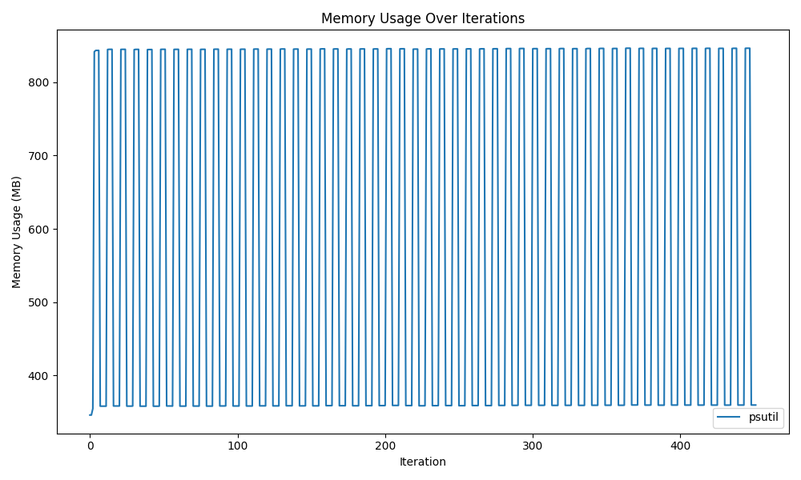
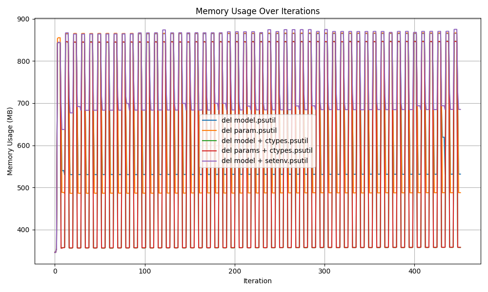

# HuggingFace Model Memory Cleanup Experiment

HuggingFaceのモデルをメモリから解放する方法の調査。

## CPU

```bash
cd cpu
./run.sh
```

### 1. `del model; gc.collect();`で削除



#### 2. モデルのパラメータを手動で削除 + `del model; gc.collect();`



#### 3. `del model; gc.collect();` + `ctypes.CDLL("libc.so.6")`で削除



#### 4. モデルのパラメータを手動で削除 + `del model; gc.collect();` + `ctypes.CDLL("libc.so.6")`で削除


#### 5. `os.environ["MALLOC_TRIM_THRESHOLD_"] = "-1"` + `del model; gc.collect();`で削除



#### 6. `export MALLOC_TRIM_THRESHOLD_=-1` + `del model; gc.collect();`で削除



#### All


